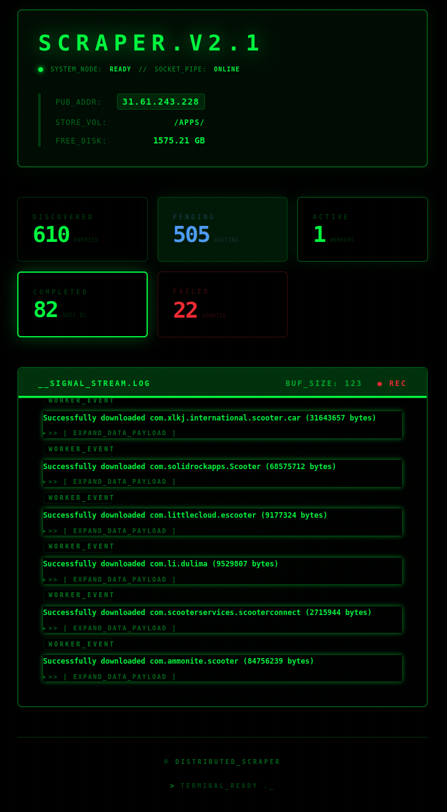
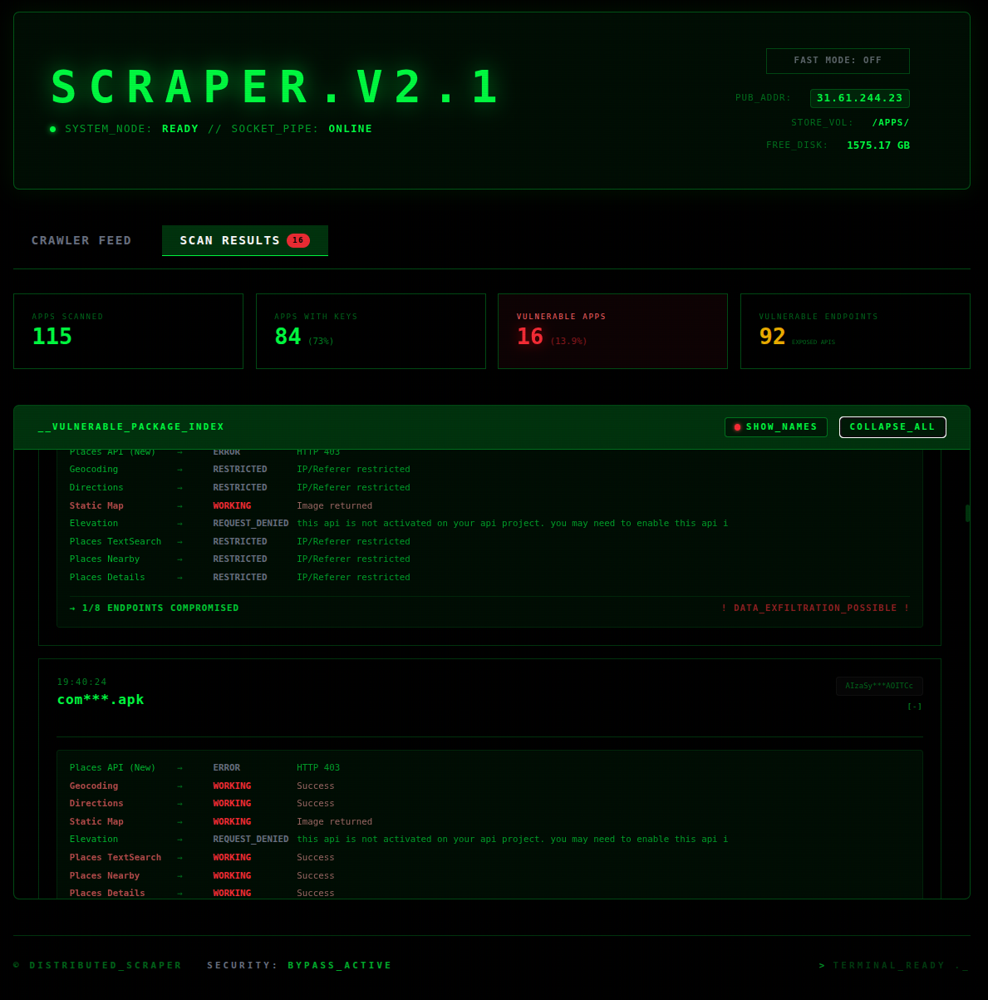
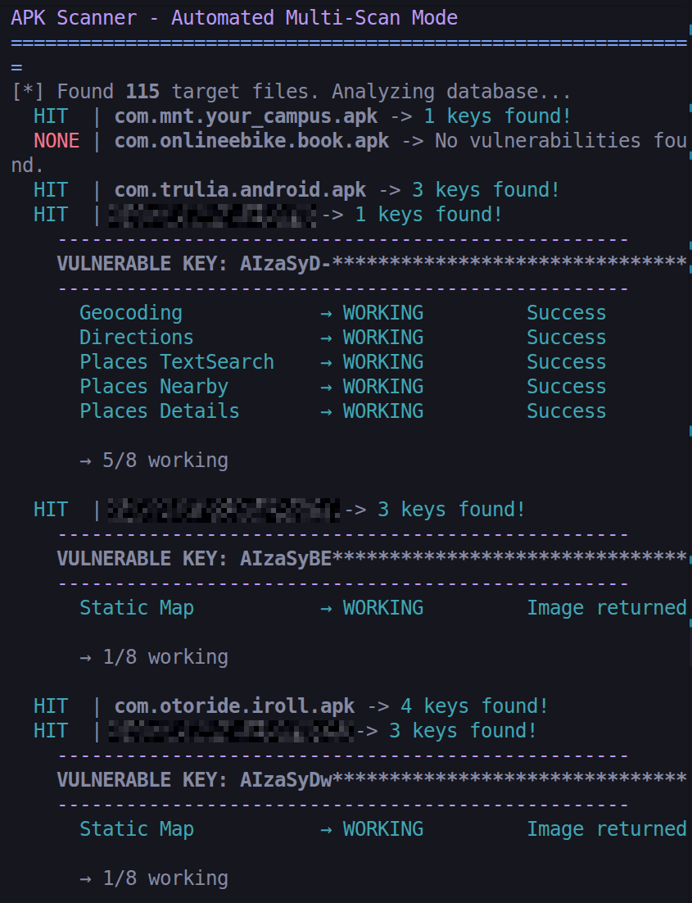

# Android Credential Exposure Scanner

A security tool for researchers and developers to detect accidentally embedded Google Maps API keys in Android packages (APK, XAPK, APKM, AAB) and evaluate their exposure risk.




## 🛡️ Security Analysis Pipeline

The analyzer runs on a scalable microservices architecture managed by `docker-compose`.

- **MongoDB**: Central state for analysis queues and exposure matrices. Mounted to `./mongodb_data` on host for complete persistence of security records.
- **Dashboard (FastAPI + Svelte)**: Real-time UI at `http://localhost:8000` to visualize log streams, credential exposure metrics, and endpoint vulnerability grids. Features a Privacy Mode to censor target packages during public disclosure or presentations.
- **Discovery Module**: An optional scraping worker (`cloudscraper`) to discover publicly available Android packages for evaluating large-scale API exposure trends.
- **Queue Workers**: Scalable async downloaders handling HTTP backoffs and spawning the extraction engine.
- **Analysis Engine**: Deep archive traversal utilizing optimized regex to identify potentially exposed strings, followed by safe verification of their permissions against Maps platform endpoints.

## 🚀 Deployment

Spin up the entire analysis cluster:

```bash
docker-compose up -d --build
# Open the Dashboard: http://localhost:8000
```

---

## 🛠️ Local Analysis Tools

While Docker manages the distributed pipeline, local Python CLI tools provide immediate utility for focused security workflows.

### Batch Scanning (`apk.scan.py`)
The automated hub for scanning local directories. Differentially scans new packages in `./apps/` (by hashing), tests credential privileges, and stores exposure results in MongoDB with high-visibility terminal logging. **This is the primary script for local operations.**



```bash
# Analyze all packages in ./apps/
python apk.scan.py
```

### Focused Inspection (`apk_grok.py`)
Deep-dive into a single target payload to instantly evaluate its credential exposure without utilizing the database.

```bash
python apk_grok.py path/to/app.apk
```

### Headless Web Spider (`apk_getter.py`)
If you don't run the Docker stack, fetch analysis targets manually.

```bash
python apk_getter.py --query "weather" --limit 10
```

## ⚖️ Ethics & Responsible Disclosure

This tool is strictly intended for educational purposes and authorized security research:
- It is designed to evaluate exposure risk, not to exploit or harvest credentials for unauthorized activities.
- **Responsible Disclosure:** If a valid, high-privilege key is discovered in a publicly available application, researchers should proactively notify the application developer or Google through official responsible disclosure programs.
- The authors are not responsible for any misuse of this tool. Use entirely at your own risk.
